**Lab Rule and Citation**
Lab test: Serum Potassium (K+)
Normal Range: 3.5-5.0 mmol/L
Rule Implemented:
If potassium < 3.5 -> Abnormal (low)
If potassium > 5.0 -> Abnormal (high)
Otherwise -> Normal
Citation: Sur M, Mohiuddin SS. Potassium. [Updated 2024 Oct 5]. In: StatPearls [Internet]. Treasure Island (FL): StatPearls Publishing; 2025 Jan-. Available from: https://www.ncbi.nlm.nih.gov/books/NBK539791/?utm_source

----------------------------------------------

Loom Link: 
--------------------------------------------
**Google Cloud (GCP) Function Deployment- Potassium Classifier**

The serverless function was deployed on Google Cloud Run (2nd generation) in the us-central1 region using the Flask framework and Python 3.12. The function runs on Google's fully managed severeless infrastructure, which automatically scales with demand. This function acceps JSON input contain a potassium value and classified the levels as normal or abnormal based on clinical reference ranges. Authentiction was configured as unauthenticated to enable open HTTP requests for demonstration purposes. 

**Deployment Instructions:**

All steps were performed in the Google Cloud Shell using the gcloud command-line interface. The function was deployed to Cloud Run under the project ezzahahi2025. The necessary files including (main.py) and (requirements.txt) were organized inside the gcp/ folder of the repo. Then, the command gcloud functions deploy potassium-classifier --gen2 --region=us-central1 --runtime=python312 --source=. --entry-point=potassium_classifier --trigger-http --allow-unauthenticated was used to deploy the function, package the source files, upload them to Cloud Run, and create a public HTTP endpoint. Google cloud managed the environment setup, installed all necessary dependencies, and generated the container image. After deployment, there was confirmation of the creation of the function and also a generated public URL for testing annd confirming that the function's entry point (potassium_classifier) was accurately recognized. Thus, the deployment logs verified all dependencies are installed without errors.

 
**Demonstration of Deployment and Output**

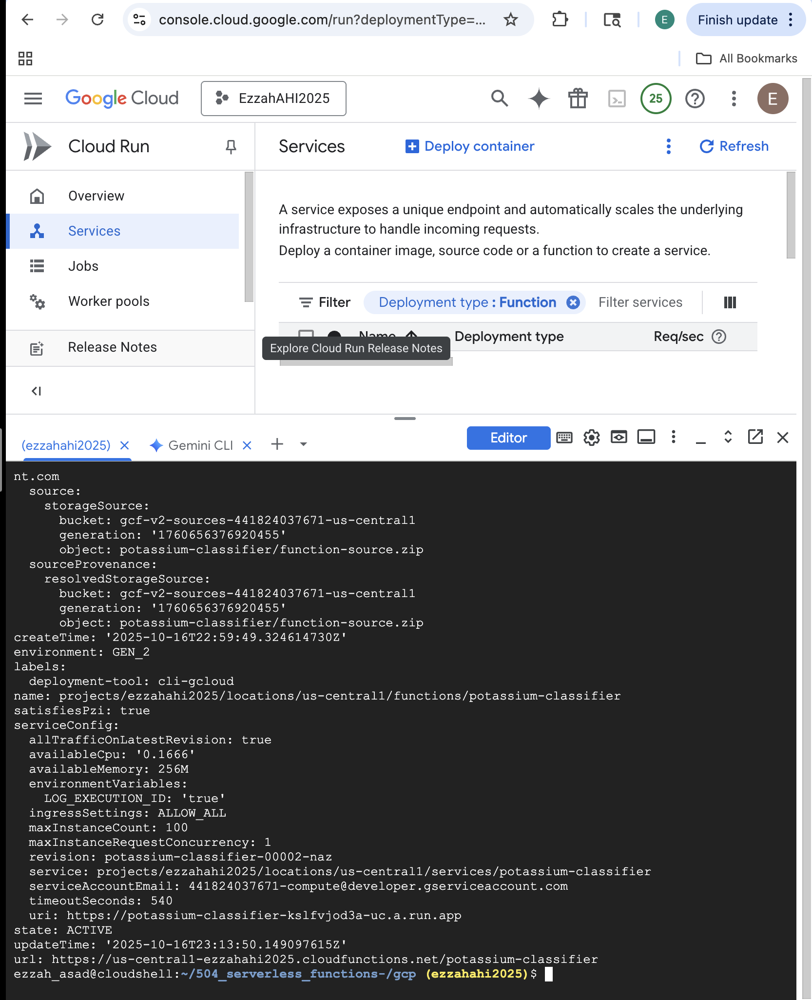
This screenshot captures the results of running the sucesss deployment of the potassum-classifier function using the gcloud command-line interface (CLI) within the Google Cloud Shell. The function is being deployed to the Cloud Run (2nd generation), confirming it ran in Python 3.12 in the us-central region. It also displays the public endpoint URL generated, further confriming the function was created successfully and is accessible. 

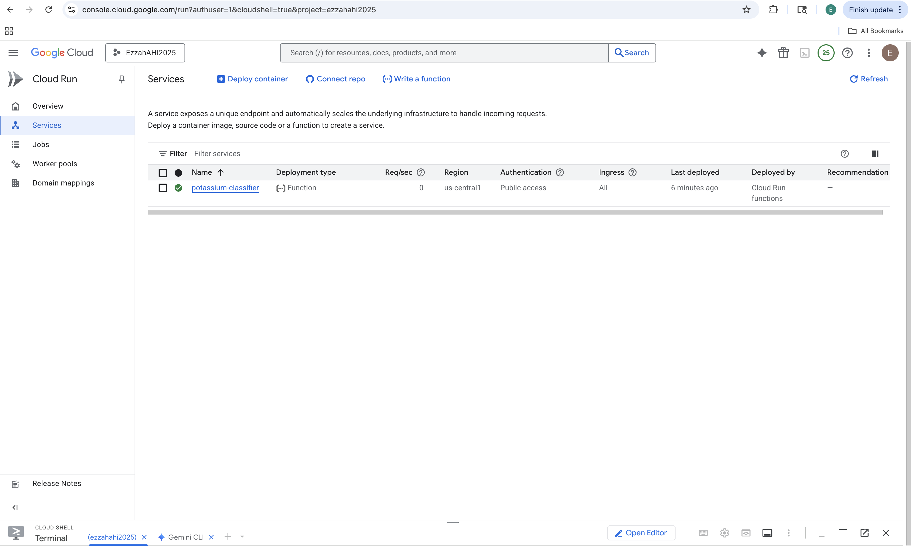
This screenshot shows that under Cloud Run services, the function potassium-classifier was deployed. This confirmed the deploymnet type (Function), the region (us-central1), and authentication access (public). 

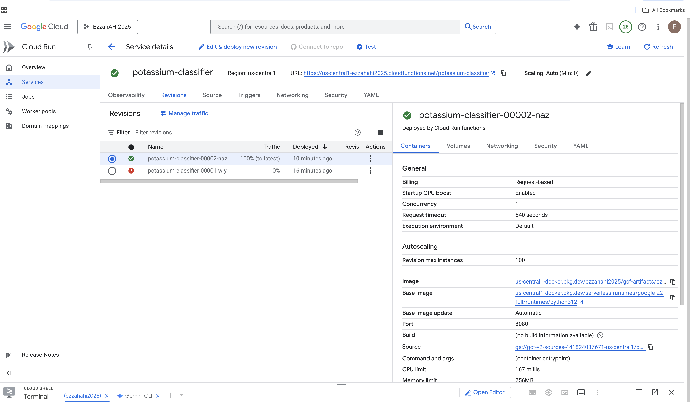
This screenshot shows the configurations (runtime, scarling, Functions Framework) and confirms that the internal settings are accurate and correct. 

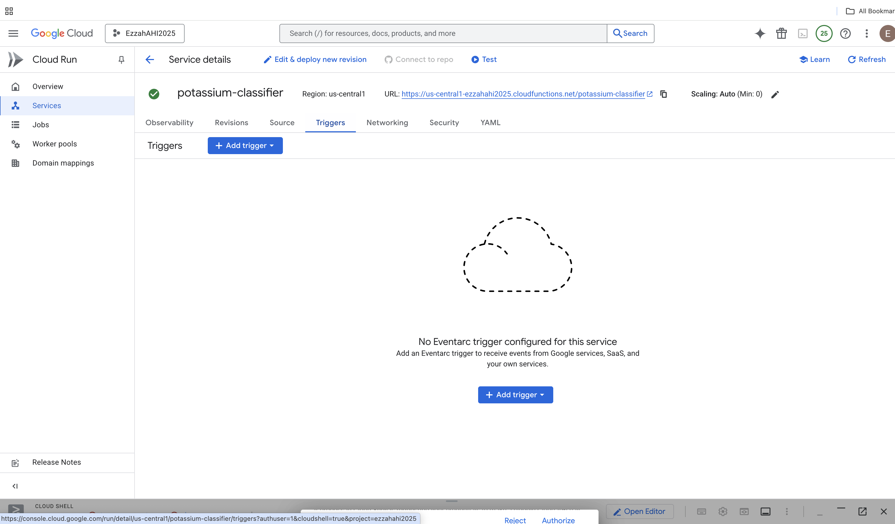
This screenshot displays the public endpoint URL as well as the trigger type, confriming the accessibility and the authentication settings. 

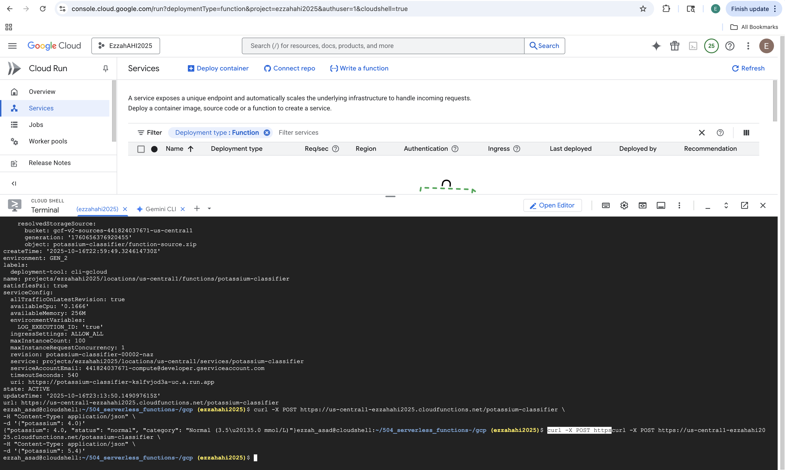
This screenshot shows the request for a real test and the correct JSON response. This demonstrated and confrimed that the function was working. 

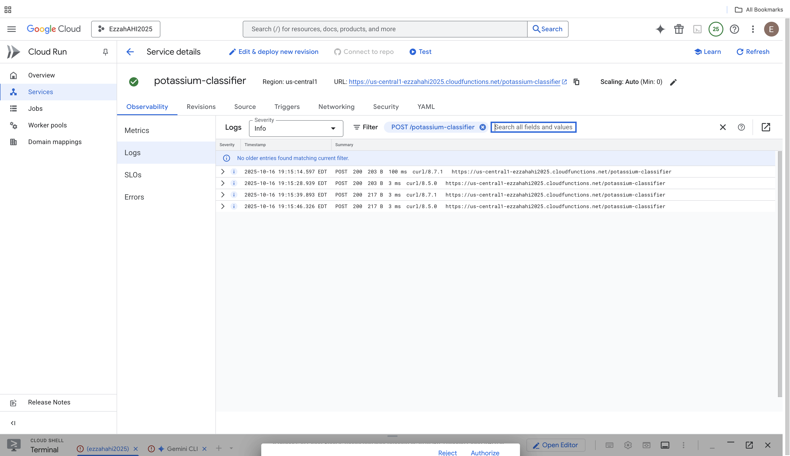
This screenshot captures all of the logs confirming all of the successful requests (POST 200) and is the final validation that proves its runtime activity and success. 

**Public Endpoint and Authentication**

The deployed function's public endpoint:
https://us-central1-ezzahahi2025.cloudfunctions.net/potassium-classifier
As mentioned previously, authentication was set to unauthenticated, which allows anyone to send POST requests without an API key. By doing so, this will make the function publicly accessible for demonstration purposes. 

**Example Request and Response**

A POST request was used to test the function with JSON input containing a potassium value using the command  curl -X POST https://us-central1-ezzahahi2025.cloudfunctions.net/potassium-classifier -H "Content-Type: application/json" -d '{"potassium": 4.2}'. The response output was  { "potassium": 4.2, "status": "normal", "category": "Normal (3.5–5.0 mmol/L)" } Values outside this range, such as 5.4, return "status": "abnormal" as expected, confirming the implemented rules were reflected. 

**Validation of Results**
The function's classification results aligned with the reference range defined by StatPerals (NCBI Bookshelf,2024) since it states that normal serum potassium levels fall between 3.5 and 5.0 mmol/L, When tested with the potassium value of 4.2 mmol/L, the function correctly responded with "Normal", which supported our rule and clinical standards. 
_______________________________________________

**Azure Function Deployment- Potassium Classifier**

This serverless function was deployed using Microsoft Azure Function on a Linux Consumption Plan. Python on Azure's managed infrastructure handles all scaling and environment setup automatically, and authentication was set to anonymous for open access during testing and demonstration. iThis function accepts JSON input with its potassium value, classifying as Normal or Abnormal based on the same clinical reference range (Normal 3.5-5.0 mmol/L).

**Deployment Instructions**

Using the Azure Functions Core Tools (func) command- line interace, all steps were performed within the Azure Cloud Shell and then deployed to the Azure Functions (Linux Consumpption Plan). This was under the resource group labeled as potassium-classifier-20250grouo-bd20 in the East US region. The files, __init__.py, function.json, and requirements.txt were organized inside the azure/ folder of the repository. These explained the classifier logic, HTTP trigger, and dependencies. The command func init --worker-runtime python
func new --name potassium_classifier --template "HTTP trigger" --authlevel "anonymous" created the function structure and also generated the trigger configuration file (function.json). Once the classifier logic in __init__.py was confirmed, the function was deployed with the command func azure functionapp publish potassium-classifier-2025 which packaged the files, uploaded them to azure, and performed a remote build. From this, Azure installed all dependencies from requirements.txt. The deployment was confirmed when we saw the message "The deployment was successful!" and also a public Invoke url attached the confirmed the potassium_classifier function was accessible. 

**Demonstration of Deployment and Output**

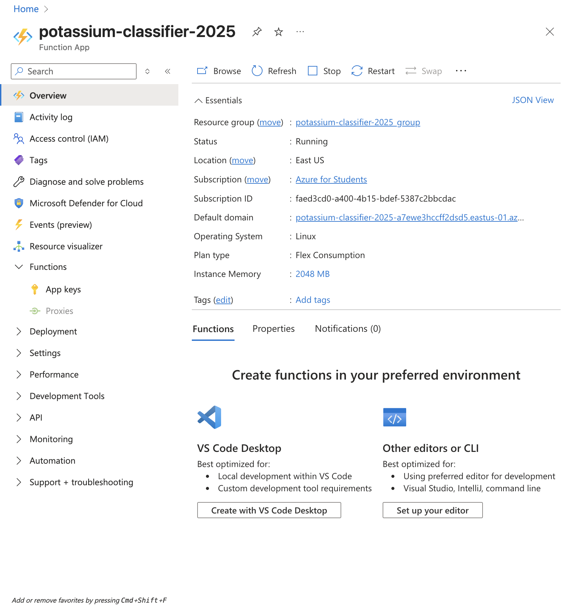
This screenshot displays the Azure Function App Overview for potassium-classifier-2025. The status of the application is runnings in the East US region on a Linux environment under the Azure for Students subscription. Deployment was verified and completed, and application was active since default domain, Flex Consumption Plan and instance memory allocation (2048 MB) are shown.

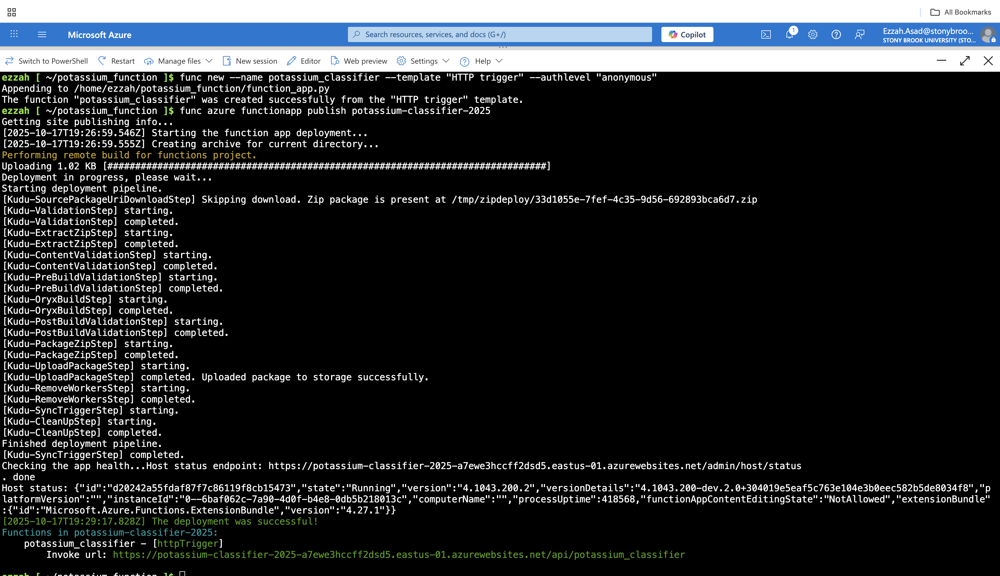
This screenshot shows the Azure Cloud shell during the deployment process. The command func azure functionapp publish potassium-classifier-2025 was used in order to build and deploy the function. Terminal output confirms that Azure performed a remote build, validated all dependencies, and completed the deployment pipeline succesfully as the message was given with the general invoke URL. 

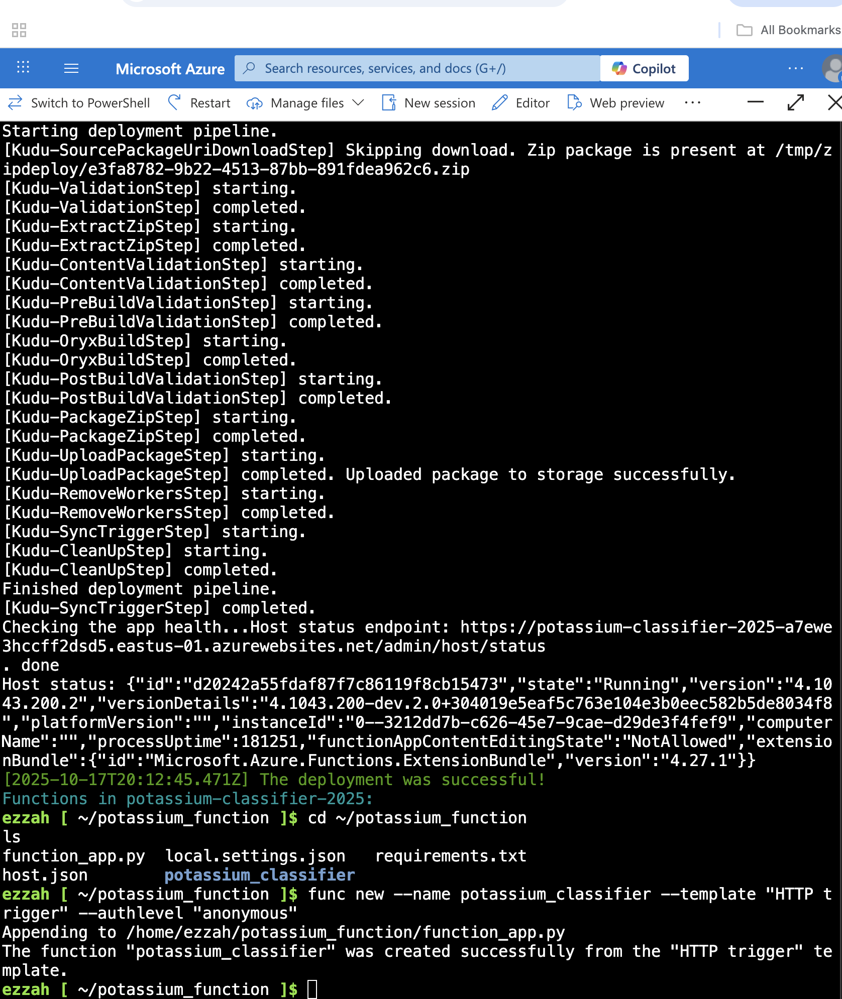
This screenshot shows the creation of the HTTP trigger function using the command func new --name potassium_classifier --template "HTTP trigger" --authlevel "anonymous". The output confirms successful function generation, and the listed files (function_app.py, host.json, requirements.txt) verify that the project structure was properly initialized before deployment.

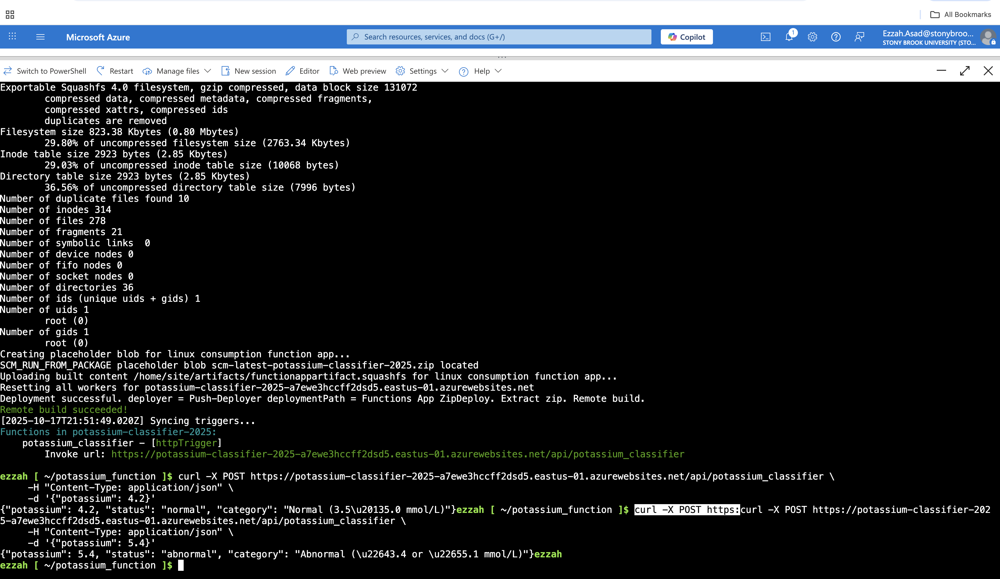
This screenshot shows the final Azure function deployment logs and successful POST request tests. Function accrately returned JSON responses which showed whether potassium levels were "normal" or abnormal". 

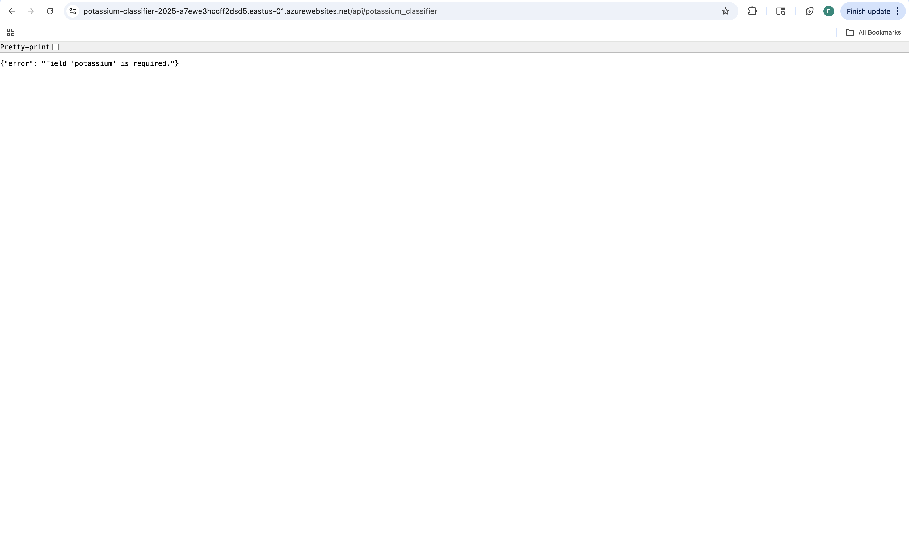
API returned an expected validation message stating "Field 'potassium' is required") when accessed without input. This confirmed that the endpoint was active and handling requests accurately. 

**Public Endpoint and Authentication**

URL: https://potassium-classifier-2025-a7ewe3hccff2dsd5.eastus-01.azurewebsites.net/api/potassium_classifier
Authentication was set to anonymous which would allow anyone with the function's public URL to send a request without any API key or login. 

**Example Request and Response**

A POST request was used in order to test the deployed Azure Function with JSON input containing a potassium value. The command curl -X POST https://potassium-classifier-2025-a7ewe3hccff2dsd5.eastus-01.azurewebsites.net/api/potassium_classifier \
-H "Content-Type: application/json" \
-d '{"potassium": 4.2}'in the Azure Cloud Shell was put in which the function responded with the expected JSON output {
  "potassium": 4.2,
  "status": "normal",
  "category": "Normal (3.5–5.0 mmol/L)"
}. This was double confirmed by also testing 5.4 where the function returned with "status: "abnormal", further confirming and supporting the accuracy of our reference, and that it was functioning properly. 

**Validation of Results**

As mentioned before, when testing the values of 4.2 mmol/L, the function returned "normal" whereas higher values such as 5.4 mmol/L returned "abnormal". The function's classification results aligned with the reference range defined by StatPerals (NCBI Bookshelf,2024) since it states that normal serum potassium levels fall between 3.5 and 5.0 mmol/L, showing that it reproduced the same validated clinical rule that was implemented in the Google Cloud version.

_______________________________________________

**AZURE VS. GCP**

Between Azure and GCP, I found GCP to be easier and quicker to deploy the potassium-classifier function compared to Azure. I was able to complete the deployment on GCP much more smoothly within the Cloud Shell using a single CLI command. The build and deployment logs appeared clearly, and the public endpoint was generated without any major troubleshooting. The only issue I had initially encounrtered was when the function's trigger URL displayed error messgages when accessing immediately after deployment. I resolved this by restarting the deployment and making sure I was using the correct plan, region, and that the authentication was set to unauthenticated. On the other hand, Azure had more manual steps and trouble shooting, which delayed the deployment for a longer period. There were a lot of errors including region restrictions (RequestDisallowedbyAzure), missing requirement files, directory path errors, Nano editor, and save failures. When I was finally succesfful in deploying, the function had then failed to display the invoke URL, which I then had to reinitialize the project and manually edit the function.json and __init__.py files. I had assistance with AI to resolve some of these issues as well learn some new techniques such as incorporating the Nano editor for file editing. This was useful because many of the steps were asking to switch between the Python and Bash environments. 
